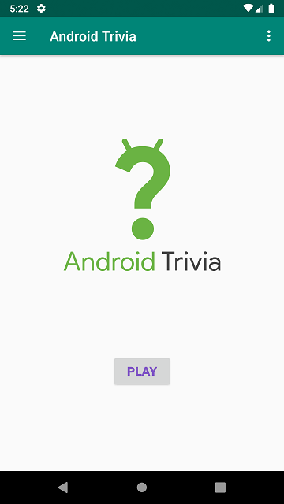
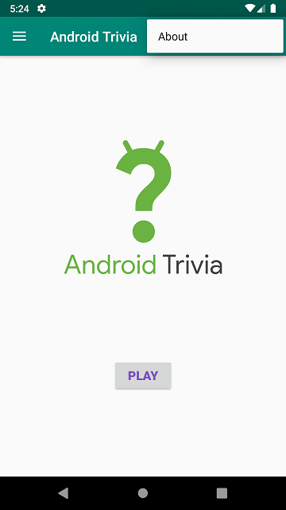

The Android Trivia application is an application that asks the user trivia questions about Android development. It makes use of the Navigation component within Jetpack to move the user between different screens. Each screen is implemented as a Fragment.

It utilizes Navigation, NavigationUI, Navigation Graph, Intents, Fragments, the Action Bar, Up Button, Overflow Menu, Navigation Drawer, Animations etc.

## Screenshots

 
 
 
 